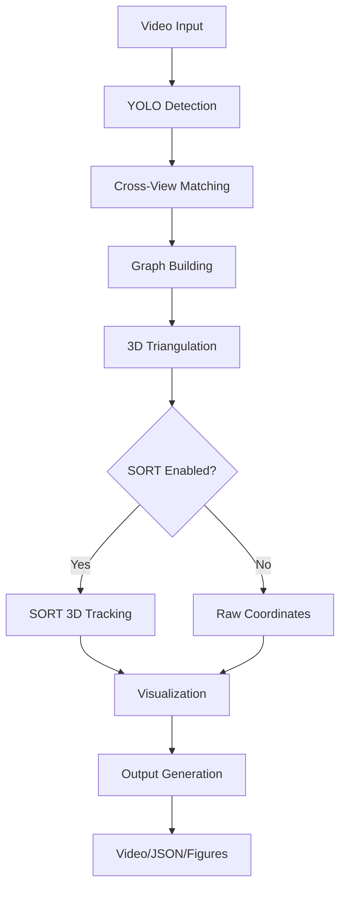

<div align="center">

# 🎥 Multi-Camera Object Detection and 3D Tracking System


*Advanced multi-camera tracking system: Real-time detection, epipolar geometry matching, 3D reconstruction, and SORT tracking with comprehensive visualization*

[](https://www.python.org)
[](https://opencv.org)
[](https://pytorch.org)
[](https://networkx.org)
[](LICENSE)

[Features](#-features) •
[Installation](#-installation) •
[Usage](#-usage) •
[Technical Details](#-technical-details) •
[Configuration](#-configuration) •
[Examples](#-examples)

</div>

---

## ✨ Features

### 🔧 Core Functionality
- **📹 Multi-Camera System**: Synchronized processing of 4 camera feeds
- **🎯 YOLO Object Detection**: Real-time detection with configurable confidence thresholds
- **🔄 Cross-View Matching**: Advanced epipolar geometry-based correspondence
- **🌐 3D Reconstruction**: Robust triangulation with RANSAC outlier rejection
- **📊 Graph-Based Detection Management**: NetworkX for tracking detection relationships

### 🚀 Advanced Tracking
- **🎯 SORT 3D Tracking**: State-of-the-art 3D object tracking with Kalman filtering
- **📍 Multiple Reference Points**: Choose from center, top, bottom, or feet positions
- **🔗 Temporal Consistency**: Track objects across frames with trajectory visualization
- **⚡ Real-time Performance**: Optimized for live video processing

### 📊 Visualization & Output
- **🖥️ Real-time Multi-View Display**: Live video mosaic with detection overlays
- **📈 Detection Graph Visualization**: Interactive node-edge representation
- **🌍 3D Position Plotting**: Real-time 3D scatter plots with trajectories
- **💾 Flexible Output Options**: JSON coordinate export, video recording, figure export
- **🎨 Customizable Display**: Modular visualization components

### ⚙️ Flexibility & Control
- **🎛️ Extensive CLI Options**: Fine-tune every aspect of the system
- **🔧 Headless Operation**: Run without visualization for batch processing
- **📁 Multi-format Export**: High-resolution figure export with customizable DPI
- **🎯 Class Filtering**: Track specific object classes (person, vehicle, etc.)

## 🚀 Installation

### Prerequisites
- Python 3.8 or higher
- CUDA-compatible GPU (recommended for YOLO inference)
- 4 synchronized camera videos
- Camera calibration files

### Setup Instructions

```bash
# Clone the repository
git clone https://github.com/your-username/4_camera_norm_tracker.git
cd 4_camera_norm_tracker

# Create and activate virtual environment
python -m venv venv
source venv/bin/activate  # Linux/Mac
# or
.\venv\Scripts\activate   # Windows

# Install dependencies
pip install -r requirements.txt

# Download YOLO model (if not already present)
# Place yolo11x.pt in the root directory
```

### Required File Structure
```
4_camera_norm_tracker/
├── config_camera/          # Camera calibration files
│   ├── 0.json              # Camera 0 intrinsic/extrinsic parameters
│   ├── 1.json              # Camera 1 parameters
│   ├── 2.json              # Camera 2 parameters
│   └── 3.json              # Camera 3 parameters
├── videos/                 # Input video directory
│   ├── cam0.mp4           # Synchronized camera videos
│   ├── cam1.mp4
│   ├── cam2.mp4
│   └── cam3.mp4
├── yolo11x.pt             # YOLO model weights
└── four_view_tracker/      # Core modules
    ├── main_plot.py       # Main execution script
    ├── matcher.py         # Cross-view matching
    ├── triangulation.py   # 3D reconstruction
    ├── sort_3d_tracker.py # SORT 3D tracking
    └── ...
```

## 💻 Usage

### Basic Usage

```bash
# Run with default settings (all visualizations enabled)
python four_view_tracker/main_plot.py --video_path videos

# Run with SORT 3D tracking
python four_view_tracker/main_plot.py --video_path videos --use_sort

# Save 3D coordinates to JSON file
python four_view_tracker/main_plot.py --video_path videos --save_coordinates --output_file tracking_results.json
```

### Advanced Usage Examples

```bash
# Headless processing (no visualization)
python four_view_tracker/main_plot.py --video_path videos --headless --save_coordinates

# Custom YOLO model and confidence threshold
python four_view_tracker/main_plot.py --video_path videos --yolo_model custom_model.pt --confidence 0.8

# Track multiple object classes (person=0, car=2, bicycle=1)
python four_view_tracker/main_plot.py --video_path videos --class_list 0 1 2

# Use feet reference point for better ground plane tracking
python four_view_tracker/main_plot.py --video_path videos --reference_point feet --use_sort

# SORT tracking with custom parameters
python four_view_tracker/main_plot.py --video_path videos --use_sort --max_age 15 --min_hits 2 --dist_threshold 0.8

# Export high-resolution figures
python four_view_tracker/main_plot.py --video_path videos --export_figures --export_dpi 600 --figures_output_dir results/

# Selective visualization (only 3D plot and video)
python four_view_tracker/main_plot.py --video_path videos --no-graph

# Save output video without live visualization
python four_view_tracker/main_plot.py --video_path videos --headless --save-video --output-video results.mp4
```

### Visualization Control

```bash
# Show only video mosaic
python four_view_tracker/main_plot.py --video_path videos --no-graph --no-3d

# Show only 3D tracking plot
python four_view_tracker/main_plot.py --video_path videos --no-graph --no-video

# Show only detection graph
python four_view_tracker/main_plot.py --video_path videos --no-3d --no-video
```

## 🔧 Configuration

### Command Line Arguments

| Argument | Type | Default | Description |
|----------|------|---------|-------------|
| `--video_path` | str | "videos" | Path to video directory |
| `--use_sort` | flag | False | Enable SORT 3D tracking |
| `--save_coordinates` | flag | False | Save 3D coordinates to JSON |
| `--output_file` | str | "output.json" | JSON output filename |
| `--yolo_model` | str | "yolo11x.pt" | YOLO model path |
| `--confidence` | float | 0.6 | YOLO detection confidence |
| `--class_list` | int[] | [0] | Object classes to track |
| `--reference_point` | str | "bottom_center" | Triangulation reference point |

#### SORT Parameters
| Argument | Type | Default | Description |
|----------|------|---------|-------------|
| `--max_age` | int | 10 | Max frames without detection |
| `--min_hits` | int | 3 | Min detections before tracking |
| `--dist_threshold` | float | 1.0 | Max association distance (m) |

#### Matching Parameters
| Argument | Type | Default | Description |
|----------|------|---------|-------------|
| `--distance_threshold` | float | 0.4 | Epipolar distance threshold |
| `--drift_threshold` | float | 0.4 | Ambiguous match threshold |

#### Visualization Control
| Argument | Type | Default | Description |
|----------|------|---------|-------------|
| `--headless` | flag | False | Disable all visualization |
| `--no-graph` | flag | False | Disable graph visualization |
| `--no-3d` | flag | False | Disable 3D plot |
| `--no-video` | flag | False | Disable video mosaic |
| `--save-video` | flag | False | Save output video |
| `--output-video` | str | "output.mp4" | Output video path |

#### Export Options
| Argument | Type | Default | Description |
|----------|------|---------|-------------|
| `--export_figures` | flag | False | Export final frame plots |
| `--export_dpi` | int | 300 | Figure export DPI |
| `--figures_output_dir` | str | "exported_figures" | Export directory |

### Reference Point Options

Choose the optimal reference point for your use case:

- **`bottom_center`** (default): Bottom center of bounding box - good for general tracking
- **`center`**: Geometric center of bounding box - stable for object center tracking  
- **`top_center`**: Top center of bounding box - useful for head tracking
- **`feet`**: 20% above bottom center - optimized for human foot position tracking

## 📊 Examples

### Example 1: Basic Person Tracking
```bash
python four_view_tracker/main_plot.py --video_path videos --use_sort --reference_point feet --save_coordinates
```

### Example 2: Multi-Class Vehicle Tracking
```bash
python four_view_tracker/main_plot.py --video_path videos --class_list 2 3 5 7 --confidence 0.7 --use_sort
```

### Example 3: High-Precision Research Setup
```bash
python four_view_tracker/main_plot.py \
    --video_path videos \
    --use_sort \
    --min_hits 5 \
    --max_age 20 \
    --confidence 0.85 \
    --distance_threshold 0.2 \
    --reference_point center \
    --save_coordinates \
    --export_figures \
    --export_dpi 600
```

### Example 4: Batch Processing
```bash
python four_view_tracker/main_plot.py \
    --video_path videos \
    --headless \
    --use_sort \
    --save_coordinates \
    --save-video \
    --output_file batch_results.json \
    --output-video batch_output.mp4
```

## 🔬 Technical Details

### 1. Multi-View Matching System (`matcher.py`)

**Epipolar Geometry Implementation:**
```python
# Cross-distance calculation between detections
d_cross = dist_to_epipolar_line_1 / bbox_size_1 + dist_to_epipolar_line_2 / bbox_size_2
```

**Key Features:**
- **Fundamental Matrix Computation**: Automatic stereo geometry calculation
- **Temporal Consistency**: Maintains match history for robust tracking
- **Ambiguity Resolution**: Handles conflicting matches using drift thresholds
- **Multi-Camera Support**: Scales to arbitrary camera configurations

### 2. 3D Reconstruction (`triangulation.py`)

**RANSAC Triangulation Pipeline:**
```python
1. Convert 2D points to homogeneous coordinates
2. Build linear system from projection matrices  
3. Solve using SVD for optimal 3D point
4. Apply RANSAC for outlier robustness
5. Validate via reprojection error
```

**Robustness Features:**
- **Linear Triangulation**: Direct Linear Transform (DLT) algorithm
- **RANSAC Implementation**: Handles noisy detections and outliers
- **Error Validation**: Reprojection error checking for quality control

### 3. SORT 3D Tracking (`sort_3d_tracker.py`)

**Kalman Filter State Model:**
```python
State vector: [x, y, z, dx, dy, dz]  # Position + velocity
Motion model: Constant velocity in 3D space
```

**Advanced Features:**
- **Hungarian Algorithm**: Optimal detection-to-track assignment
- **Track Lifecycle Management**: Handles track birth, maintenance, and death
- **Trajectory Storage**: Maintains complete object paths for visualization
- **Class Consistency**: Tracks object class changes for validation

### 4. Detection Graph System (`main_plot.py`)

**NetworkX Graph Structure:**
```python
Nodes: Individual detections
  - Attributes: camera_id, detection_id, bbox, centroid, class
Edges: Matched detections across views
  - Attributes: geometric distance, confidence score
Components: Connected components represent same physical object
```

**Graph Operations:**
- **Dynamic Construction**: Real-time node and edge creation
- **Component Analysis**: Connected component extraction for object grouping
- **Visualization**: Interactive graph layout with color coding

## 🎯 Performance Considerations

### Computational Efficiency
- **Parallel Video Processing**: Simultaneous multi-camera frame loading
- **Optimized Matching**: Efficient epipolar geometry calculations
- **Graph Operations**: NetworkX optimizations for real-time performance
- **Memory Management**: Controlled trajectory and cache sizes

### Accuracy Factors
- **Camera Calibration Quality**: Accurate intrinsic/extrinsic parameters crucial
- **Detection Confidence**: Higher thresholds reduce false positives
- **Matching Thresholds**: Balance between precision and recall
- **RANSAC Parameters**: Iteration count vs. computation time trade-off

### Real-time Performance Tips
- Use GPU for YOLO inference
- Adjust visualization complexity based on hardware
- Consider headless mode for maximum throughput
- Optimize video resolution for your use case

## 🛠️ System Architecture



## 🐛 Troubleshooting

### Common Issues

**No detections found:**
- Check YOLO model compatibility
- Adjust confidence threshold
- Verify video file formats

**Poor 3D reconstruction:**
- Validate camera calibration files
- Check camera synchronization
- Adjust matching thresholds

**Performance issues:**
- Reduce visualization complexity
- Use headless mode
- Check GPU availability for YOLO

## 🤝 Contributing

We welcome contributions! Please follow these steps:

1. Fork the repository
2. Create a feature branch (`git checkout -b feature/AmazingFeature`)
3. Commit your changes (`git commit -m 'Add AmazingFeature'`)
4. Push to the branch (`git push origin feature/AmazingFeature`)
5. Open a Pull Request

### Development Guidelines
- Follow PEP 8 style guidelines
- Add docstrings to all functions
- Include unit tests for new features
- Update documentation as needed

## 📄 License

This project is licensed under the MIT License - see the [LICENSE](LICENSE) file for details.

## 🙏 Acknowledgments

- **SORT Algorithm**: Based on the original SORT paper by Bewley et al.
- **YOLO**: Object detection using Ultralytics YOLO models
- **OpenCV**: Computer vision and calibration utilities
- **NetworkX**: Graph-based detection management

---

<div align="center">

[⬆ Back to top](#-multi-camera-object-detection-and-3d-tracking-system)

</div>
