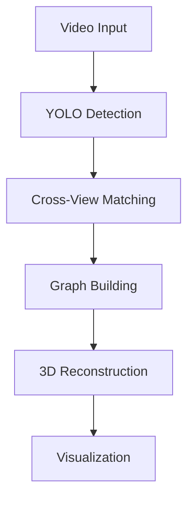

<div align="center">

# 🎥 Multi-Camera Object Detection and 3D Tracking System


*Multi-camera tracking system in action: Shows simultaneous video feeds, detection graph, and 3D tracking visualization*

[](https://www.python.org)
[](https://opencv.org)
[](https://pytorch.org)
[](LICENSE)


[Features](#✨-features) •
[Installation](#🚀-installation) •
[Technical Details](#🔬-technical-details) •
[Usage](#💻-usage)

</div>

---

## ✨ Features

- 📹 **Multi-Camera System**: Synchronized processing of 4 camera feeds
- 🎯 **Object Detection**: YOLO-based real-time detection
- 🔄 **Cross-View Matching**: Epipolar geometry-based correspondence
- 🌐 **3D Reconstruction**: Accurate position triangulation
- 📊 **Real-time Visualization**: 
  - Video mosaic
  - Detection graph
  - 3D position tracking

## 🚀 Installation

```bash
# Clone repository
git clone https://github.com/bielaltoe/4_camera_norm_tracker.git
cd four-view-tracker

# Create virtual environment
python -m venv venv
source venv/bin/activate  # Linux/Mac
.\venv\Scripts\activate   # Windows

# Install dependencies
pip install -r requirements.txt
```

## Details

### 1. Multi-View Matching System (matcher.py)

The matcher module implements sophisticated cross-view correspondence:

```python
# Matching Pipeline
1. Compute fundamental matrices between camera pairs
2. Calculate epipolar lines for each detection
3. Measure geometric consistency via cross-distance
4. Filter matches using RANSAC and threshold
```

Key components:
- **Epipolar Geometry**: Uses fundamental matrices for geometric constraints
- **Cross-Distance Metric**: Normalized point-to-line distance measure

  $$d_{cross} = \frac{|a_1x_1 + b_1y_1 + c_1|}{\sqrt{a_1^2 + b_1^2}(w_1 + h_1)} + \frac{|a_2x_2 + b_2y_2 + c_2|}{\sqrt{a_2^2 + b_2^2}(w_2 + h_2)}$$

  where $(x_i,y_i)$ are detection centroids, $(a_i,b_i,c_i)$ are epipolar line coefficients, and $(w_i,h_i)$ are bounding box dimensions.
- **Match Filtering**: Handles ambiguous matches and outliers

### 2. 3D Reconstruction (triangulation.py)

Implements robust 3D position estimation:

```python
# Triangulation Pipeline
1. Convert points to homogeneous coordinates
2. Build linear system from projection matrices
3. Solve using SVD for optimal 3D point
4. Apply RANSAC for robustness
5. Validate via reprojection error
```

Features:
- **Linear Triangulation**: Direct Linear Transform (DLT) algorithm
- **RANSAC Implementation**: Handles outliers and noise
- **Error Validation**: Reprojection error checking

### 3. Detection Graph System (main.py)

Uses NetworkX for detection management:

```python
# Graph Structure
Nodes: Individual detections
  - Attributes: camera_id, detection_id, bbox, centroid
Edges: Matched detections
  - Attributes: geometric distance, confidence
Components: Represent same physical object
```

Key operations:
- **Graph Building**: Dynamic node and edge creation
- **Component Analysis**: Connected component tracking
- **Visualization**: Real-time graph updates

## 💻 Usage

### 1. System Setup

Place required files:
```
project/
├── config_camera/     # Camera calibration
│   ├── 0.json
│   ├── 1.json
│   ├── 2.json
│   └── 3.json
├── videos/           # Input videos
│   ├── cam0.mp4
│   ├── cam1.mp4
│   ├── cam2.mp4
│   └── cam3.mp4
└── yolo11x.pt       # YOLO model
```

### 2. Configuration

Key parameters in `config.py`:
```python
YOLO_MODEL = "yolo11x.pt"          # Detection model
CONFIDENCE = 0.85                  # Detection threshold
DISTANCE_THRESHOLD = 0.3           # Matching threshold
```

### 3. Running the System

```bash
python main.py videos
```

The system will display:
- Real-time video mosaic
- Detection graph visualization
- 3D tracking results
- Saves output as `output.mp4`

## 🔧 System Architecture



## 📈 Performance Considerations

1. **Computational Efficiency**:
   - Parallel video processing
   - Optimized matching algorithms
   - Efficient graph operations

2. **Accuracy Factors**:
   - Camera calibration quality
   - Detection confidence
   - Matching thresholds
   - RANSAC parameters

3. **Real-time Performance**:
   - Frame rate optimization
   - Visualization efficiency
   - Memory management

## 🤝 Contributing

1. Fork the repository
2. Create feature branch (`git checkout -b feature/AmazingFeature`)
3. Commit changes (`git commit -m 'Add AmazingFeature'`)
4. Push to branch (`git push origin feature/AmazingFeature`)
5. Open Pull Request

## 📄 License

MIT License - see [LICENSE](LICENSE) file

---

<div align="center">

Work in progress

[⬆ Back to top](#-multi-camera-object-detection-and-3d-tracking-system)
</div>
